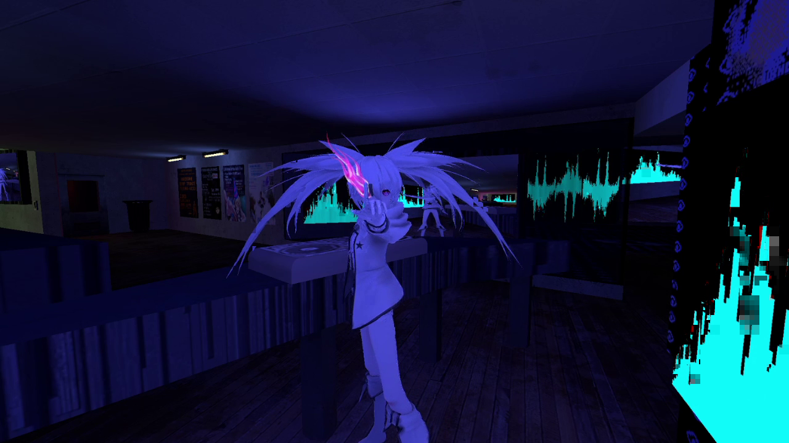

Garry's Mod VRMod Streaming Camera
==================================

A 3rd-person camera for capturing and streaming content in Garry's Mod while
using VRMod. NOTE: this add-on requires
[VRMod](https://steamcommunity.com/sharedfiles/filedetails/?id=1678408548),
it is not a standalone (yet)!



When you launch VRMod, this camera will automatically spawn with your
configured settings by default. This behavior can be stopped by setting
`vrmod_camera_autostart` to `0`. To bring up the menu and configure these
settings manually, type `vrmod_camera_menu` into the console. It doesn't
really matter if you're in VRMod or not while using the menu. Pressing the
"Start" button will spawn a camera, while the "Remove" button will remove the
selected camera. You may spawn as many cameras as you please!

For the `vrmod_camera_menu` command:

- "Start" button will spawn the camera with the configured settings (or update the existing camera)
- "Remove" button will stop displaying your camera
- "Autospawn" will stop spawning the camera by default

For the toolgun:

- Left-click: Spawn or move the camera
- Right-click: Erase the camera

*The toolgun is probably broken, just use the menu unless you care to fix it :)*

3rd person and static cameras are supported at the moment; first-person
smoothing is planned.

You can also use these console commands to control the camera:

```
vrmod_camera_mode
    - 1 = Static
    - 2 = Smoothed third-person
    - 3 = Smoothed first-person (not implemented yet :D)
```

```
vrmod_camera_smoothing
    - Lower values make the camerawork more responsive (but more "rough" too)
```

```
vrmod_camera_stabilize
    - Camera yaw is always zero
```

```
vrmod_camera_flydist
    - 1 = Near
    - 2 = Middle
    - 3 = Far
```

```
vrmod_camera_autospawn
    - Whether to spawn the camera when you launch VRMod or not
```

```
vrmod_camera_draw
    - Whether to draw the camera model or not in the real world
```

```
vrmod_camera_switch <id>
    - Switch to a given camera whose ID is <id>
    - You can use this to change cameras easily if you bind this command!
```

.. usually the defaults are pretty good IMO!

Examples
----------

I have used this camera several times to stream gameplay using OBS to Twitch.
When I can be bothered to cut some example footage for this repository I will
upload it somewhere :)

Contributing / Source Code
--------------------------

All development of this add-on is done on [the Github page for this
project](https://github.com/yumi-xx/gmod-vrmod-camera) so all issues / feature
requests should be submitted there by creating a new issue. Pull requests are
respected and are actually very helpful in developing / maintaining this
project.

Code is not licensed so do whatever you want to with it; O am not responsible
for instigating or enabling thermonuclear war etc. etc. :)
